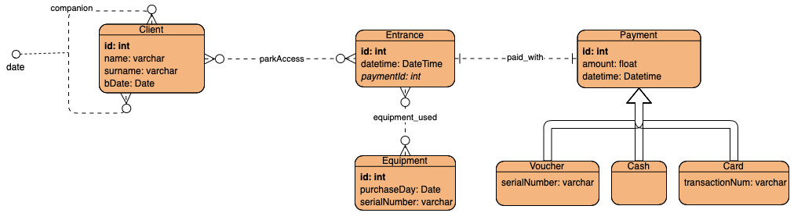
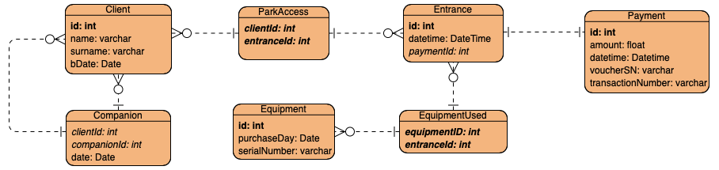

# FunAdventure

Link alla repository: https://gitlab.com/daviderendina/2020_assignment3_meet_your_friends

## Studenti
Il progetto è stato svolto in autonomia dallo studente Rendina Davide matricola 830730.

## Descrizione del dominio
FunAdventure è un applicativo che permette la gestione degli ingressi in un parco avventura. Attraverso questa applicazione, è possibile effettuare la registrazione dei clienti; per i clienti minorenni, è necessario specificare quale degli altri clienti è il suo accompagnatore (che deve essere maggiorenne). Ogni cliente effettua un INGRESSO nel parco, gli viene fornita un ATTREZZATURA e comincia ad effettuare i percorsi desiderati. Al termine della sua permanenza, è possibile effettuare il PAGAMENTO mediante tre tipologie differenti: voucher, carta, contanti.

## Progettazione del DB

### Schema ER

### Descrizione delle entità

Tutte le entità presentate successivamente hanno un campo intero progessivo chiamato id, che rappresenta appunto l'id dato a una particolare istanza che è anche chiave primaria della tabella. Nelle descrizioni successive, questo campo è stato omesso.

#### Client
Rappresenta un cliente registrato nel sistema del parco avventura, descritto dai suoi dati anagrafici (nome, cognome, data di nascita). Un cliente (che indicheremo con cliente1) può essere in relazione *companion* con altri n clienti (cliente2), e una relazione di questo tipo indica che il cliente1 è accompagnatore del cliente 2.

#### Relazione: park_access
Mette in relazione l'accesso al parco con i clienti che l'hanno effettuato. In particolare la relazione è di cardinalità n:n poichè ad un unico accesso al parco possono essere collegati più *Client* (ad esempio per i gruppi) mentre un'unico *Client* può essere presente in diversi ingressi (ad esempio, in giornate diverse).

#### Entrance
Questa entità rappresenta un singolo ingresso che viene effettuato al parco, da uno o più clienti (insieme). Un ingresso è definito solamente dalla data e ora di quando lo stesso è stato effettuato. Una *Entrance* è in relazione con un *Payment* (con cardinalità 1:1), che descrive appunto il pagamento effettuato per lo specifico ingresso.

#### Equipment
Lo tolgo?

#### Payment
Descrive il pagamento effettuato dal/dai clienti nei confronti del parco al termine della loro visita. È descritto da un campo float *amount*, che rappresenta il conto totale da pagare per quella *Entrance*, e dalla data e ora del pagamento. *Payment* è una generalizzazione di tre diverse entità: *Voucher*, *CreditCard* e *Cash*.

#### Voucher
Rappresenta il pagamento effettuato tramite voucher dal cliente. Un pagamento di questo tipo è descritto anche dal numero seriale del voucher utilizzato dal cliente.

#### CreditCard (da chiamare solo card)
Rappresenta il pagamento effettuato tramite carta/bancomat, e aggiunge un nuovo campo che contiene il numero di transazione del pagamento.

#### Cash
Rappresenta il pagamento effettuato tramite contanti.

### Schema logico

