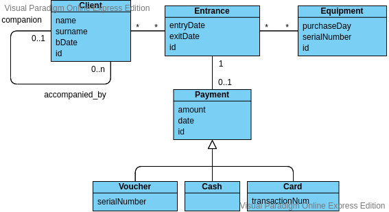

# FunAdventure

Link alla repository: https://gitlab.com/daviderendina/2020_assignment3_meet_your_friends

Il progetto è stato svolto in autonomia dallo studente Rendina Davide matricola 830730.

## Descrizione dell'applicazione
FunAdventure è un applicativo che permette la gestione degli ingressi in un parco avventura. Attraverso questa applicazione, è possibile effettuare la registrazione dei clienti; per i clienti minorenni, è necessario specificare quale degli altri clienti è il suo accompagnatore (che deve essere maggiorenne). Uno o più clienti effettuano un INGRESSO nel parco, viene fornita loro un ATTREZZATURA (tipicamente, un casco) e cominciano ad effettuare i percorsi desiderati all'interno del parco stesso. Al termine della permanenza di tutti i clienti associati a un particolare ingresso, è possibile effettuare il PAGAMENTO dei percorsi effettuati mediante tre tipologie: VOUCHER, CARTA e CONTANTI.

## Configurazione del progetto
Per impementare questo progetto è stato scelto l'utilizzo del framework Hibernate per garantire ORM in combinazione con un istanza di MySql. In particolare, Hibernate è stato configurato come segue:
- È stata generata una sola PersistentUnit, per tutte le entità del domain.
- È stato selezionato un valore hibernate.hbm2ddl.auto = update, per far si che le modifiche vengano effettuate sempre sullo stesso db e che lo stesso non venga ad esempio ricreato ad ogni utilizzo del sistema (come accadrebbe ad esempio con un valore create).
- Se non viene trovata nessun database con il nome specificato, esso viene automaticamente creato

Al fine di funzionare correttamente, deve essere presente un istanza di MySql con la seguente configurazione:
- Deve essere in ascolto sulla porta localhost:3306 (default di MySql)
- Presenza di un utente con username "funadventure" e password "QYqJcfgMh3#v"

### Run del progetto
Per testare il progetto, sono stati implementati appositi test unitari attraverso JUnit. Per eseguirli, è necessario eseguire i seguenti comandi:
- _git clone https://gitlab.com/daviderendina/2020_assignment3_meet_your_friends.git_
- _cd 2020_assignment3_meet_your_friends_
- _mvn test_

## Diagramma di dominio

### Descrizione delle classi

Ogni classe ha un attributo di tipo integer chiamato id, che rappresenta il UID dato dal sistema all'oggetto.

#### Client
Rappresenta un cliente registrato nel sistema del parco avventura, descritto dai suoi dati anagrafici (nome, cognome, data di nascita). Un *Client* può essere in relazione con altri n *Client* (*accompanied_by*); questa relazione indica che il cliente dalla parte n della relazione è il maggiorenne accompagnatore (*companion*) dell'altro.

#### Relazione: park_access
Mette in relazione un accesso al parco con i *Client* che l'hanno effettuato. In particolare la relazione è di cardinalità n:n poiché ad un unico accesso al parco possono essere collegati più clienti (ad esempio per i gruppi) mentre un unico cliente può essere presente in diversi ingressi (ad esempio, in giornate diverse).

#### Access
Questa entità rappresenta un singolo ingresso che viene effettuato al parco. Un *Access* viene definito solamente da due timestamp relativi alla creazione dell'ingresso (entrata dei clienti nel parco) e alla chiusura e pagamento dello stesso (uscita di tutti i clienti dal parco).
Un *Access* è in relazione con un *Payment* (con cardinalità 1 - 0..1) che rappresenta il pagamento effettuato per lo specifico ingresso; il pagamento è definito con relazione 0 poiché avviene in un momento successivo alla creazione dell'ingresso. Presenta anche le relazioni *park_access* e *equipment_used* con rispettivamente i clienti e l'equipaggiamento dell'accesso.
La classe *Access* contiene quindi le due collezioni relative alle relazioni della classe *Access* con *Equipment* (relazione *equipment_used*) e *Client* (relazione *park_access*).

#### Relazione: equipment_used
Relazione con cardinalità n:m che mette in relazione un *Access* con tutti gli *Equipment* che sono stati utilizzati in quell'accesso. La cardinalità è n:m poiché in un *Access* potrebbero esserci diversi *Equipment* utilizzati (ad esempio, da clienti diversi) e allo stesso tempo un *Equipment* può essere in relazione con diversi *Access* (in giorni diversi).

#### Equipment
Rappresenta un singolo equipaggiamento (es. casco, imbrago, ..) in possesso del parco avventura. È descritto dalla sua data di acquisto e dal numero seriale.

#### Payment
Descrive il pagamento effettuato dai clienti nei confronti del parco al termine della loro visita. È descritto da un campo float *amount*, che rappresenta il conto saldato, e dalla data e ora del pagamento. *Payment* è una generalizzazione di tre diverse entità, che rappresentano i diversi tipi di pagamento possibili: *Voucher*, *CreditCard* e *Cash*.

#### VoucherPayment
Rappresenta il pagamento effettuato tramite voucher dal cliente. Un pagamento di questo tipo è descritto anche dal numero seriale del voucher utilizzato dal cliente.

#### CardPayment
Rappresenta il pagamento effettuato tramite carta/bancomat, e aggiunge un nuovo campo che contiene il numero di transazione del pagamento.

#### CashPayment
Rappresenta il pagamento effettuato tramite contanti.

## Architettura e package

L'applicazione è stata divisa in 4 package principali:
1. Domain
2. Service
3. Repository
4. Utils

### Domain
Il package *domain* contiene tutte le classi che rappresentano le entità del domino (i POJO).
Ogni entità è stata mappata attraverso le annotazioni JPA con una tabella del database. In particolare per il campo *Payment* nell'entità *Access*, è stato definito un valore di CascadeType ALL, per far sì che ogni operazione effettuata sull'*Access* sia applicata anche all'entità *Payment*.

### Service
Questo package rappresenta lo strato di Service dell'applicazione, contenente tutta la logica di businness del sistema. Per ogni entità (*Client*, *Access*, *Equipment* e *Payment*) è presente un Service, che implementa la logica di businness e successivamente comunica con lo strato di *Repository* per persistere le operazioni sul db. In particolare, ogni Service contiene un oggetto Repository corrispondente per delegare le varie operazioni.
Al fine di facilitare l'accesso ai servizi forniti da questo strato, è presente una *ServiceFacade* che ha il compito di esporre la API per utilizzare lo strato.

Per *PaymentService*, è stato definito un comportamento diverso dalle altre entità. Anche se *PaymentRepository* implementa tutte le operazioni CRUD, il Service utilizza solamente le funzioni di ricerca (find), poiché un *Payment* è strettamente legato al suo *Access* di riferimento. Per questo motivo, il campo *Payment* della classe *Access* è stato annotato con @Cascade(CascadeType.ALL), in modo che ogni operazione CRUD effettuata sull'*Access* venga applicata anche sul *Payment*.

Questo strato del sistema contiene anche la classe *PaymentFactory*, una Factory che si occupa di creare un oggetto di tipo Payment.

### Repository
Questo package rappresenta lo strato di Repository dell'applicazione, che ha lo scopo di interfacciarsi con il database per effettuare le operazioni CRUD sulle entità; per ogni entità (*Client*, *Access*, *Equipment* e *Payment*) è presente una diversa repository. Ogni repository implementa un'interfaccia *Repository*, che ha il compito di uniformare le API di accesso al db per tutte le istanze.
Per effettuare le operazioni sul db, ogni repository utilizza un'istanza di EntityManager.

### Utils
Contiene solamente la classe *IdGenerator*, che ha la responsabilità di generare gli UID per tutti gli oggetti del sistema.
